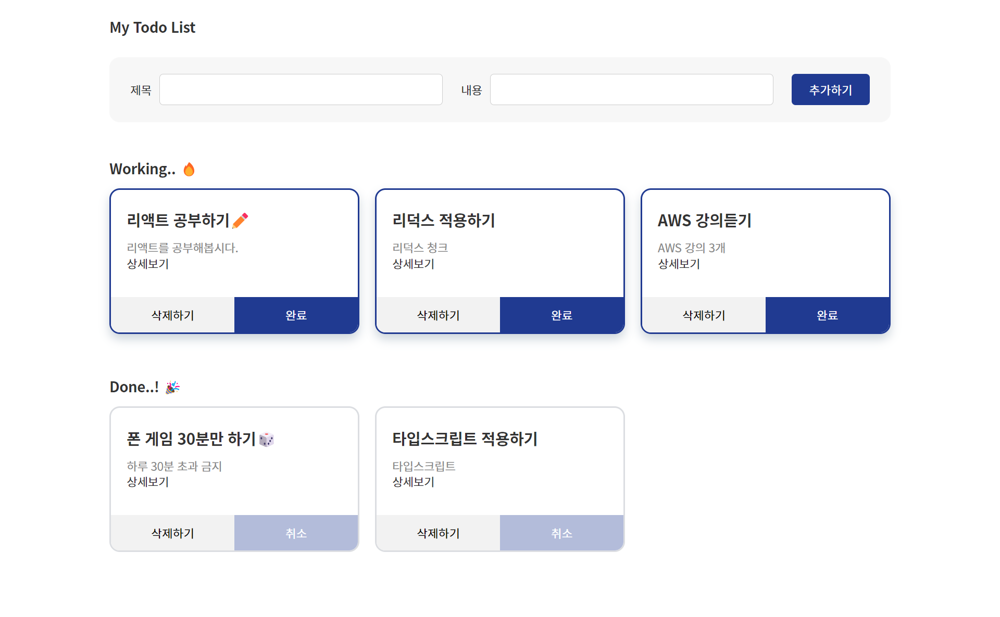

# My Todo List 사이트

## 프로젝트 소개

리덕스 청크와 타입스크립트를 적용하여 투두리스트 사이트 만들기

   
  
   

 

## 기술 스택

### Environment

 

### Development

  
    
    
 
  

 

## 구현 기능

### 기능 1

투두리스트 추가, 조회, 완료, 삭제

### 기능 2

상세페이지 이동
